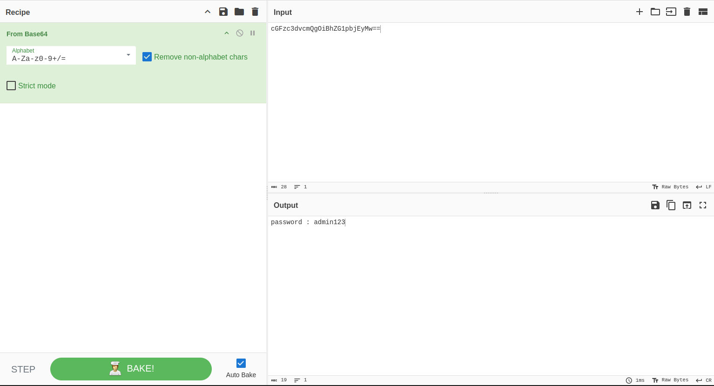

# Basic Cryptography

## Overview

Cryptography is the science and art of securing information by transforming it into a format that is difficult for unauthorized parties to understand. It is the backbone of modern digital security, ensuring the Confidentiality, Integrity, and Availability (CIA Triad) of data, as well as providing Non-repudiation (preventing someone from denying they sent a message).

## Primary Bullet Points

- **Core Goal:** Cryptography protects the CIA Triad and adds Non-repudiation (nir-penyangkalan) to digital communications.
- **Hashing:** A one-way, irreversible function that turns data into a unique, fixed-length string. Used for verifying integrity, not for hiding data.
- **Salting:** Adding random data to a password before hashing it to defeat pre-computed attacks (like Rainbow Tables).
- **Symmetric Encryption:** Uses the *same* secret key to lock (encrypt) and unlock (decrypt) data. Fast, but sharing the key safely is hard.
- **Asymmetric Encryption:** Uses a *key pair* (Public and Private). One encrypts, the other decrypts. Slower, but solves the key-sharing problem.
- **PKI:** The system of certificates and authorities that allows us to trust public keys on the internet (enabling HTTPS).

## Learning Objectives

- Understand the fundamental differences between Hashing, Encoding, and Encryption.
- Learn how Salting protects against basic hash-cracking attacks.
- Differentiate between Symmetric and Asymmetric encryption algorithms.
- Grasp the basics of Public Key Infrastructure (PKI) and digital certificates.
- Identify and use industry-standard tools for encoding, decoding, and hash cracking.

## Background

In cybersecurity, we often need to prove who we are, verify that data hasn't been tampered with, or keep data secret. Cryptography provides the mathematical rules for how to do this. A common beginner mistake is confusing *encryption* (which is meant to be reversed) with *hashing* (which is meant to be one-way). Understanding these distinctions is critical before attempting to hack or defend authentication systems.

## Key Concepts

### 1. Hashing
**General Explanation:** Hashing is the process of converting an input of any length into a fixed-size string of characters using a mathematical algorithm (e.g., SHA-256). It is strictly irreversible—you cannot derive the original input from the hash. It is primarily used to verify data integrity (e.g., checking if a file has been modified) and to securely store passwords.  
**Baby Talk Explanation:** Think of a meat grinder. You can put a whole cow (input) into the grinder, and it comes out as ground beef (hash). But no matter how hard you try, you cannot turn that ground beef back into a cow. If someone changes even one hair on the cow before grinding it, the resulting ground beef will look completely different.

### 2. Salting
**General Explanation:** A "salt" is a randomly generated string that is added to a plaintext password *before* it is hashed (e.g., `password123` + `x9F$kL` = `password123x9F$kL`, which is then hashed). This ensures that even if two users have the exact same password, their hashes will be completely different. It renders pre-computed "Rainbow Tables" useless.  
**Baby Talk Explanation:** Imagine two people order a plain coffee. If the barista writes their names on the cups (the salt), the two cups are now unique. Even if the coffee (password) is the same, the barista (the hacker) can't just grab any cup and assume it belongs to the same person.

### 3. Symmetric Encryption
**General Explanation:** Symmetric encryption uses a single secret key to both encrypt and decrypt data. Because the same key is used for both operations, it is computationally very fast. However, the primary challenge is "Key Distribution"—how do you safely share the secret key with the other person without it being intercepted?  
**Baby Talk Explanation:** It’s like a physical lockbox with one physical key. You and your friend have copies of the exact same key. If you want to send a secret letter, you lock the box and send it. Your friend uses their key to open it. But if someone steals your key while you're handing it to your friend, the box is compromised.

### 4. Asymmetric Encryption
**General Explanation:** Asymmetric encryption uses a mathematically linked pair of keys: a **Public Key** (which can be shared with anyone) and a **Private Key** (which is kept secret). Data encrypted with the public key can *only* be decrypted by the private key. It solves the key distribution problem but is slower than symmetric encryption.  
**Baby Talk Explanation:** Imagine a mailbox with a slot. Anyone can drop a letter into the slot (encrypting with your Public Key). But only you have the physical key to open the mailbox and read the letters (your Private Key). 

### 5. Public Key Infrastructure (PKI)
**General Explanation:** PKI is the framework of technologies, policies, and procedures used to manage digital certificates and public-key encryption. It binds public keys to the identities of entities (like websites) through a Certificate Authority (CA). This is what allows your browser to securely trust that `https://google.com` is actually Google.  
**Baby Talk Explanation:** PKI is like a passport system. You can claim to be anyone, but the government (Certificate Authority) issues you a passport (Digital Certificate) that proves your identity. When you show up at the border (website), the guard (your browser) checks the passport to make sure it's legitimate.

## Cryptography Tools & Their Uses

As requested, here is an expanded explanation of the tools you mentioned and how cybersecurity professionals use them:

### Encoding & Decoding Tools
*Note: Encoding is NOT encryption. It is simply changing data into a different format so systems can read it. It provides zero security.*
- **Base64:** A mathematical scheme used to represent binary data in an ASCII string format. Hackers use it to encode payloads (like malicious scripts) to bypass basic web filters. Defenders use it to decode suspicious traffic to see what is hiding inside.
- **CyberChef:** Often called the "Cyber Swiss Army Knife." This is an essential web-based application built by GCHQ (UK Intelligence). It allows you to chain multiple operations together (e.g., "Take this Base64 string, decode it, then hash it with MD5"). It is heavily used in CTFs and malware analysis.
- **dCode:** A comprehensive website for decoding ciphers. If you find an old-school cipher (like Caesar cipher, Vigenère, or Morse code) during an investigation, dCode has automated tools to break it instantly.

### Hashing & Password Tools
- **Rainbow Tables / Hashes.com:** A Rainbow Table is a massive, pre-computed database of plaintext passwords and their corresponding hashes. Instead of guessing a password and hashing it in real-time, a hacker checks the stolen hash against this database. Tools like *Hashes.com* or *CrackStation* act as online rainbow tables.
- **Bitwarden:** A highly trusted, open-source Password Manager. It doesn't just store passwords; it uses strong, locally-encrypted cryptography (usually AES-256) so that even the Bitwarden company cannot see your passwords. It demonstrates the proper way to manage secret keys.
- **Randomkeygen:** A utility used to generate cryptographically secure random strings. Security professionals use tools like this to generate strong passwords, API keys, or "Salts" for databases. You should never use a predictable word as a salt.

## Practical Exercises

- **Tool Exploration:** 
  

## Challenges Encountered

### Challenge: Confusing Encoding with Encryption
- **The Issue:** Beginners frequently mistake tools like Base64 for encryption, assuming that because the text looks scrambled, it is secure.
- **Root Cause:** Base64 output looks like random characters, visually resembling a hash or ciphertext.
- **Resolution:** Remember the golden rule:
  - **Encryption** is meant to hide data (requires a key to reverse).
  - **Hashing** is meant to fingerprint data (cannot be reversed).
  - **Encoding** is meant to format data (anyone can reverse it without a key). Base64 can be decoded instantly by any computer.

## Lessons Learned

- Cryptography is split into two main goals: keeping data secret (encryption) and proving data hasn't changed (hashing).
- Salting is mandatory for password storage to prevent attackers from using pre-computed Rainbow Tables.
- Asymmetric encryption solves the problem of safely sharing keys over the internet, enabling secure web browsing (HTTPS).
- Tools like CyberChef are essential for quickly manipulating and analyzing data during security assessments.

## Best Practices

- **Never invent your own cryptography:** Always use established, publicly tested algorithms (like AES-256 or SHA-256). "Security by obscurity" fails.
- **Always Salt Passwords:** If you are building an application, never hash a password without adding a unique, random salt first.
- **Use Password Managers:** Never reuse passwords. Use tools like Bitwarden to generate and store long, random strings for every account.

## Common Mistakes

- **Using MD5 or SHA-1:** These older hashing algorithms are considered broken and vulnerable to collision attacks. Use SHA-256 or stronger.
- **Reusing Salts:** If two users have the same salt, a hacker can still use a Rainbow Table effectively. Salts must be unique per user.
- **Transmitting Passwords in Plaintext:** If you intercept HTTP traffic and can read the password clearly without decoding, the application is failing at basic cryptography.

## Further Reading

- [Cryptopals Crypto Challenges](https://cryptopals.com/) (A great way to learn crypto by breaking it)
- [OWASP - Cryptographic Storage Cheat Sheet](https://cheatsheetseries.owasp.org/cheatsheets/Cryptographic_Storage_Cheat_Sheet.html)
- [CyberChef (The Cyber Swiss Army Knife)](https://gchq.github.io/CyberChef/)

## Summary

Basic cryptography is the mathematical foundation of digital trust. By understanding how hashing verifies integrity, how salting defends against pre-computed attacks, and how symmetric/asymmetric encryption secure our communications, we can begin to identify cryptographic flaws in applications. Tools like CyberChef and Bitwarden demonstrate how these concepts are applied practically in both offensive and defensive scenarios.