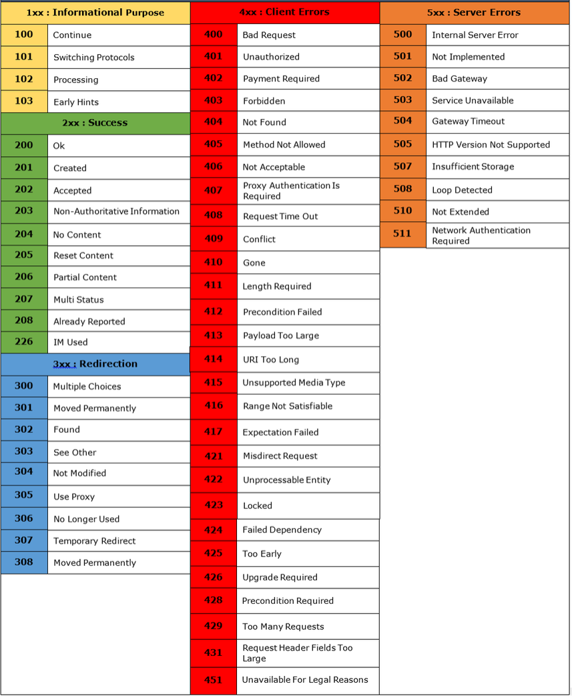
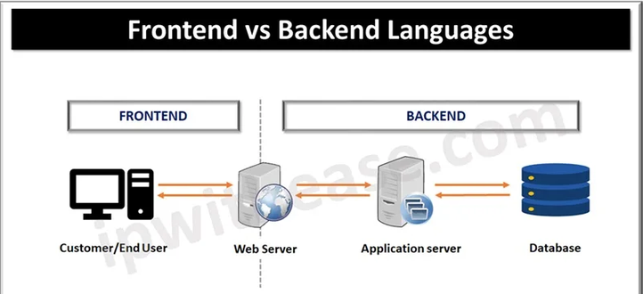

# Understanding Web Applications and HTTP

## Overview

This document outlines the foundational architecture of web applications and the mechanics of the Hypertext Transfer Protocol (HTTP). Understanding how clients and servers interact, how data is transmitted, and how to interpret HTTP responses is critical for both defending and attacking web-based systems.

## Primary Bullet Points

- **Web Architecture:** Web applications are divided into Front-end (Client-side, what the user sees) and Back-end (Server-side, business logic and data processing).
- **Core Components:** The main ecosystem consists of Clients, Web Servers, Database Servers, APIs, and Middleware.
- **HTTP Protocol:** HTTP is the communication ruleset for the World Wide Web, evolving from simple text (HTTP/0.9) to fast, multiplexed protocols (HTTP/3).
- **HTTP Methods:** Commands like GET, POST, PUT, PATCH, and DELETE dictate the action the server should take (CRUD operations).
- **Status Codes:** Three-digit numbers (1XX - 5XX) communicate the result of the HTTP request, telling the client if it succeeded, failed, or needs to redirect.

## Learning Objectives

- Understand the high-level components that make up a web application.
- Differentiate between Front-end and Back-end responsibilities.
- Learn the evolution and mechanics of the HTTP protocol.
- Identify and use standard HTTP Methods.
- Interpret HTTP Request/Response structures and Status Codes.

## Background

Before assessing the security of a web application, a professional must understand how it functions under the hood. Web applications operate on a Client-Server model. The user's browser (Client) requests resources, and the server processes these requests and returns data. This exchange happens via HTTP (or its secure counterpart, HTTPS). Misconfigurations or vulnerabilities in any of these layerswhether in the front-end code, back-end logic, or middlewarecan lead to security breaches.

## Key Concepts

### 1. Web Application Architecture
**General Explanation:** Web architecture defines how the components of a web application interact. It is generally split into two main parts: the Client-Side (Front-end) and the Server-Side (Back-end), supported by databases, APIs, and middleware.  
**Baby Talk Explanation:** Think of a restaurant. The Front-end is the dining area and the menu (what you see and interact with). The Back-end is the kitchen (where the actual cooking/logic happens). The Database is the pantry (where ingredients are stored). The API is the waiter taking your order to the kitchen, and Middleware is the manager checking if you are allowed to order from the secret menu.

### 2. Core Components
- **Client:** The user's interface, typically a web browser, used to send requests.
- **Web Server:** Software (like Apache, Nginx, IIS) that receives client requests and serves back web pages or data.
- **Database Server:** The storage layer (like MySQL, PostgreSQL) where data is managed and retrieved.
- **API (Application Programming Interface):** A bridge allowing different software applications to communicate (e.g., a web app validating a user's identity against a national ID database).
- **Middleware:** The "middleman" software between the application and the server/network that handles tasks like authentication, logging, and session management.

### 3. The HTTP Protocol
**General Explanation:** Hypertext Transfer Protocol (HTTP) is the set of rules for transferring files (text, images, sound, video) on the World Wide Web. It operates on a request-response model.  
**Baby Talk Explanation:** It's the language that browsers and servers use to talk to each other. The browser says "Give me the login page," and the server replies "Here it is."

#### Evolution of HTTP
| Version | Key Features |
| :--- | :--- |
| **HTTP/0.9** | Simplest version. Only supported `GET` requests and raw text. No headers. |
| **HTTP/1.0** | Introduced request/response headers. Allowed transfer of file types beyond text. |
| **HTTP/1.1** | Added persistent connections (keeping the connection open), chunked transfer coding, and cache control. |
| **HTTP/2** | Major performance upgrade. Introduced multiplexing (sending multiple requests over a single connection). |
| **HTTP/3** | Uses QUIC protocol over UDP for even faster, more reliable speeds. |

### 4. HTTP Methods
**General Explanation:** HTTP methods (also known as verbs) indicate the desired action to be performed on a given resource. They map closely to CRUD (Create, Read, Update, Delete) operations.  
**Baby Talk Explanation:** These are action verbs you yell at the librarian. "GET me a book!" "POST this new book to the shelf!" "DELETE this old book!"

- **GET:** Retrieve data.
- **POST:** Send/submit data to create a new resource.
- **PUT:** Update/replace an entire existing resource.
- **PATCH:** Partially update an existing resource (only specific parameters).
- **DELETE:** Remove data.
- **HEAD:** Ask for response headers only (no body).
- **OPTIONS:** Ask the server which HTTP methods are allowed on a specific endpoint.

### 5. HTTP Requests and Responses
Both requests and responses contain **Headers** (metadata about the request) and an optional **Body** (the actual data being sent).

*Example HTTP Request Header:*
```http
POST /api/login HTTP/1.1
Host: example.com
Accept: application/json
User-Agent: Mozilla/5.0
```
*Example HTTP Request Body (JSON format):*
```json
{
  "username": "admin",
  "password": "password123"
}
```

### 6. HTTP Status Codes
Three-digit numbers returned by the server to indicate the outcome of the request.
- **1XX (Informational):** Request received, continuing process.
- **2XX (Success):** Server successfully received, understood, and processed the request (e.g., 200 OK).
- **3XX (Redirection):** The requested URL has been moved or redirected to a different resource (e.g., 301 Moved Permanently).
- **4XX (Client Error):** The request was invalid or cannot be fulfilled (e.g., 404 Not Found, 403 Forbidden).
- **5XX (Server Error):** The request was valid, but the server failed to process it (e.g., 500 Internal Server Error).  
  
    Source : https://javaconceptoftheday.com/http-status-codes-cheat-sheet/

## Theoretical Study / Practical Observations

- **Front-end vs Back-end Interaction:**  
    
    Source : https://ipwithease.com/frontend-vs-backend-languages/

## Challenges Encountered

### Challenge: Identifying Common HTTP Versions in the Wild
- **The Issue:** In my notes, I recorded that HTTP/1.0 and HTTP/1.1 are the most commonly encountered versions today.
- **Root Cause:** HTTP/1.1 was the standard for almost two decades, so many older tutorials and training materials still reference it as the standard.
- **Resolution:** In reality, while HTTP/1.1 is still widely supported for backward compatibility, **HTTP/2** is currently the dominant protocol across the modern web. HTTP/3 is rapidly gaining adoption. As a penetration tester, you must be comfortable reading both HTTP/1.1 (which is plaintext by default) and HTTP/2 (which is typically binary and multiplexed over TLS). 

## Lessons Learned

- Web applications rely on distinct components (Client, Server, Database, API) working together.
- HTTP is the backbone of web communication, and its methods dictate how data is manipulated.
- Status codes are the server's way of communicating the state of a request, and reading them is crucial for both debugging applications and exploiting vulnerabilities.

## Best Practices

- **Use HTTPS:** Never transmit sensitive data over plain HTTP. Always use HTTPS (HTTP over TLS/SSL) to encrypt the traffic.
- **Method Appropriateness:** Ensure the server enforces the correct HTTP methods for specific endpoints. For example, a login page should only accept `POST`, not `GET` (as `GET` parameters end up in browser history and server logs).
- **Explicit Status Codes:** When building or securing web apps, use the most accurate status code (e.g., don't use 200 OK for a failed login; use 401 Unauthorized).

## Common Mistakes

- **Using GET for Sensitive Data:** Beginners often send passwords or tokens via `GET` request parameters (e.g., `example.com/login?user=admin&pass=123`). This is a massive security risk. Always use `POST`.
- **Ignoring 5XX Errors:** In web app testing, 5XX errors mean the application crashed. Penetration testers should probe inputs to intentionally trigger these, as it reveals backend logic flaws.
- **Assuming Front-end is Safe:** Never rely solely on front-end (JavaScript) validation. Attackers can bypass it by manipulating the HTTP request directly in a proxy.

## Further Reading

- [RFC 9110 - HTTP Semantics](https://datatracker.ietf.org/doc/rfc9110/)
- [OWASP - Web Security Testing Guide](https://owasp.org/www-project-web-security-testing-guide/)
- [MDN Web Docs - HTTP Overview](https://developer.mozilla.org/en-US/docs/Web/HTTP/Overview)

## Summary

Understanding web architecture and HTTP is the foundational step for any cybersecurity role. By learning how data flows from the front-end to the back-end, how APIs connect services, and how HTTP methods and status codes govern these interactions, we establish the baseline required to identify misconfigurations and vulnerabilities in modern web applications.